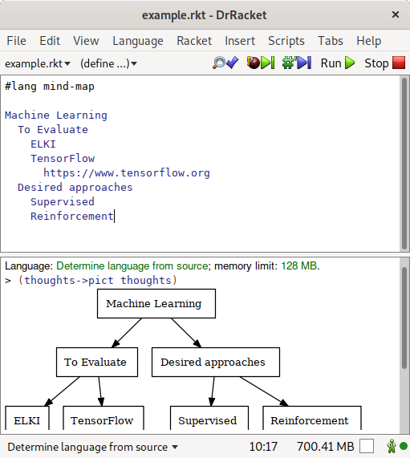

[](https://sagegerard.com/subscribe.html)
[](http://docs.racket-lang.org/mind-map/index.html)

A package for authoring mind maps using Racket.


```racket
#lang mind-map

Machine Learning
  To Evaluate
    ELKI
    TensorFlow
      https://www.tensorflow.org
  Desired approaches
    Supervised
    Reinforcement
```


